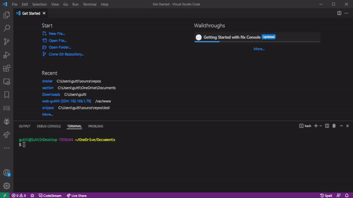
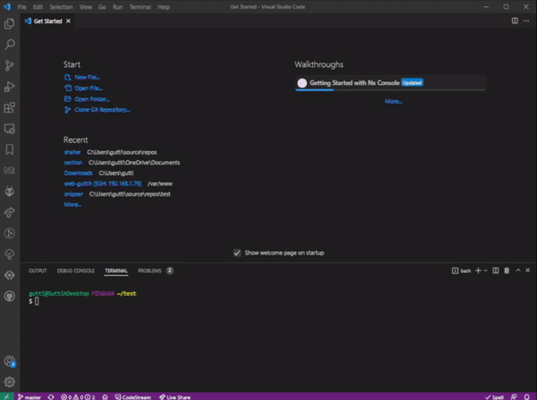

# Sheller

Download this extension from the [Visual Studio Code Marketplace][1]

This extension contains snippets and functions to help with writing bash scripts.
It includes, menus, parse options, text coloring, declaring functions, finding 
and listing files and directories and many more snippets. View the [complete snippet list](#list-of-all-snippets).

## Features

Snippets to help with bash development.

Included snippets:
 - **Boiler plate** Type *Bash Boilerplate* to create a new bash from scratch.
 - **Frame** type *frame* to create a function that prints a framed text to the terminal.
 - **Menu** Type *menuOptions* to create a bash script menu, allowing the user to select text options using the up and down arrow keys.
 - **Creating functions** 
    - type *function* to create a new function with comments
    - type *function 1 argument* to create a new function which accepts one parameter
    - type *function 2 arguments* to create a new function which accepts two parameter
    - type *function 3 arguments* to create a new function which accepts three parameter
 - **coloring text** Type *TextColors* to change the color of printed terminal text.
 - **help** Type *printHelp* To  create a help function for your bash script.
 - **Validate bash parameters** Type *parseOptions* to create a function for validating if parameters given to your bash script are correct.
 - **Does user have superuser privileges** Type *is super* to check if user has superuser privileges(root).
 - **Disk snippets**
   - Does file or directory exist
   - List files or directories
   - Set or get values from a ini configuration file
 - **Time snippets**
   - Calulate time difference and add time
 - **String snippets** 
   - Match substring within a string
   - Search for string prefix
   - Search for postfix
  - **Many more** A complete snippet list can be found in the [table below](#list-of-all-snippets).

## Usage example

### Boiler plate
This is how the snippet **Boiler plate** can be used to create a bash file, with help and check for invalid parameters, making it runnable and test it.

### Frame
How to write text inside a box to the terminal using the function frame.

 ## List of all snippets

**Prefix** is what you type to select the desired snippet.

| Prefix  | Title | Description |
|:--------|:------|:------------|
| time diff | Time difference  HH:mm:ss | Calculate time difference |
| time now | Current time | Print current time on the format HH:mm:ss |
| date and time now | Current date & time | Print current time on the format YYYY-MM-DD HH:mm:ss |
| time in future | Add to current time | Add to current time |
| file exists | Checks if a file is found | Checks if a file is found |
| dir exists | Checks if a directory is found | Checks if a Directory is found |
| list files | Iterate files in directory | Walk through each file name in a directory |
| list dirs | Iterate only directories in directory | Walk through each sub-directory name in a directory |
| list files recursive | Iterate files in directory recursive | Iterate file names in directory recursive. That is, walking through sub-directories also. |
| list files recursive reg | Iterate files in directory recursive regex | Iterate file names in directory recursively using regex.  That is, walking through sub-directories also. |
| list dirs recursive | Iterate directories in directory | Iterate directory names in directory recursively.  That is, walking through sub-directories also. |
| compare filenames in dir | Compare file names in two directories | Compare file names in two directories and prints out matching or missing file names |
| get script dir | Script directory | Get path to the the current bash file |
| get script name | Script Name | Get name of current script |
| get file name | Extract filename | Extracts filename name from a file path |
| get file directory | Extract file directory | Extracts directory from a file path. |
| get file extension | Extract file extension |  Extract file extension from a file path. |
| read text file | Read on line at a time | Read a text file one line at a time |
| ini file get value, ini file read value, iniGetSectionKeyValue, getIniSectionKeyValue | Read a value from a ini file | Get a value of a key(variable) under specified section in a configuration file |
| ini file set value, ini file write value, iniSetSectionKeyValue, setIniSectionKeyValue | Save a value to a ini file | Add or change a section key value pair in a file |
| bash, shebang, start | Start of bash | Start of bash
That is shell scripts should start with this command |
| created, file created | File creation time | Add comment with file name and, file creation time |
| source sh | source sh | Import another another shell script |
| declare array | declare array | Declare a new array and add initialize it. |
| text colors | Text Color commands | Text Color commands |
| terminal colors, text colors table | Show all terminal text colors | Show all terminal text colors and a example on how to use colors with echo |
| function | Function | Create a function which takes no argument |
| function 1 argument | Function 1 argument | Create a function which takes 1 argument |
| function 2 arguments | Function 2 arguments | Create a function which takes 2 arguments |
| function 3 arguments | Function 3 arguments | Create a function which takes 3 arguments |
| print help | Script help function | Script help function |
| print help,  one option | Help function with one option | Help function with one option |
| print help,  one option,  one option argument | Help function with one option and one option argument | Help function with one option and one option argument |
| boilerplate 1 | Boilerplate simple | Boilerplate simple Hello bash world |
| boilerplate 2 | Boilerplate, simple one option | Boilerplate bash script with help that accepts one optional parameter |
| boilerplate 3 | Boilerplate, one option, one option argument | Boilerplate with one option and one option which requires a argument |
| parse options | Check if all options are valid and saves each in a variable | Check if all options are valid and saves each in a variable |
| is super, is root, is sudo | Only allow super user to run this script | Only allow super user to run this script. |
| frame | Frame your text | Frame your text |
| menuOptions | Select pre defined option | Select pre defined option |
| arrayContains | Searches for an string within an array of strings | Searches for an string within an array of strings |
| for number | For number loop | For loop with a number condition variable |
| for number braces | For number in braces | For loop with brace expansion |
| case example | Case Example | Case Statement Example |
| case | Case | Case statement |
| extract argument name | Extract argument name from option | Extracts a name from a given argument which is on the form -name=value or name="value with spaces" |
| extract argument value | Extract argument value from option | Extracts a value from a given argument which is on the form name=value or name="value with spaces" |
| extract filename, remove directory from path, remove prefix from path | Extracts filename from the last argument | Extracts filename from the last argument and echos out all all arguments, where the last argument has been stripped of preceding path or url |
| is script sourced | Is script sourced | Check if your script is being sourced or not.  That is, if f.example environment variables created will effect the  calling shell |
| string prefix length | Prefix search known length | Check if a string starts with a specific text and is of a specific lengthS |
| string starts with | Prefix search with wildcard | Check if string starts with using wild card |
| string ends with | Postfix search | Check if string ends with |
| string cut | Substring with cut | Examples when extracting substring from a string using cut. (For when bash version is old) |
| replace text in file | Replace text in a file | Replace texts in a file that match a specified substring |
| replace text in file that starts with | Replace trailing text in a file that starts with | Replace trailing texts in a file that begin with a specified substring |
| create text file | Create multiline file | Create a text file with multiple lines |
| string remove trailing numbers | String remove trailing numbers | Function to removes all digits from the end of a string |

[Top](#sheller)

## Reading material

Some reading material which could be helpful when working with bash.

 - [Bash Guide for Beginners]
 - [Reference Manual][Bash Reference Manual devDocs] or view it as a [single page][Bash Reference Manual]

[1]: https://marketplace.visualstudio.com/items?itemName=guttih.sheller
[Bash Reference Manual]: https://www.gnu.org/software/bash/manual/bash.html
[Bash Reference Manual devDocs]: https://devdocs.io/bash/shell-functions
[Bash Guide for Beginners]: https://tldp.org/LDP/Bash-Beginners-Guide/html/Bash-Beginners-Guide.html